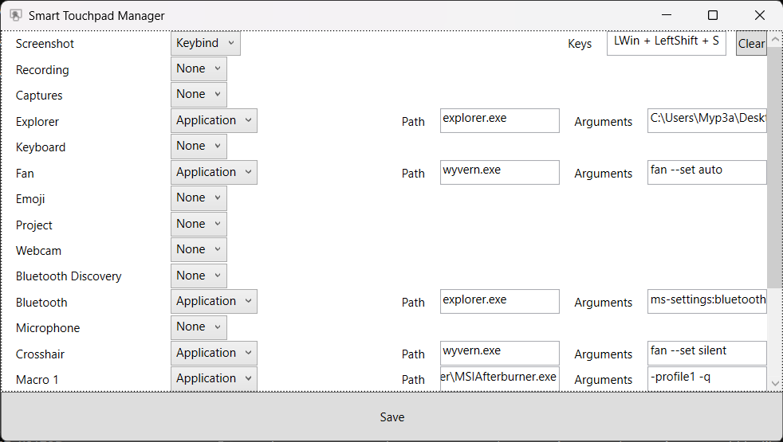

# Smart Touchpad
An utiility to customize Raider GE78HX Smart Touchpad shortcuts. Allows running apps and keybinds assignment.  

## How to use
Download [latest release](https://github.com/Myp3a/SmartTouchpad/releases/latest) and run it. Configuration is saved in `data.json` near the executable.

## Notes
Every key can be hooked, including `Power`. However, only shortcut keys are available in scope of this application. This app keeps default settings for volume slider and buttons on the right.  
Microphone volume needs external library. Not supported for now.  
Keyboard backlight control needs external library. Not supported for now.

## TODO:
 - Mic volume
 - Keyboard backlight
 - Use self-written driver instead of decompiled MSI's driver